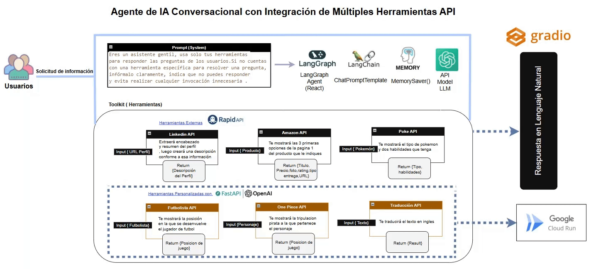

# Agente de IA Conversacional con Integración de Múltiples Herramientas API - Langgraph/Langchain/MemorySaver

## 1. Diseño de arquitectura
1.	Usuario: 
•	Inicia la conversación desde la interfaz Gradio.

2.	Agente Conversacional (LangGraph + LangChain):
•	Recibe el mensaje y consulta MemorySaver para contexto.
•	Determina la intención y elige la herramienta/API adecuada.

3.	Enrutamiento de Herramientas (@tool):
•  APIs externas:
    -	PokeAPI
    -	LinkedIn Data API
    -	Amazon Search API

•  APIs propias (desplegadas en Cloud Run):
    -	Futbolista API (posición de jugador)
    -	One Piece API (tripulación de personaje)
    -	Traducción API (texto → inglés)

4.	Llamada a las API
•	El agente hace la petición HTTP y obtiene JSON o texto.
•	Parsea y formatea los datos (tipos de Pokémon, resumen de perfil, listado de productos…).

5.	Generación de Respuesta:
•	El LLM (OpenAI) toma esos datos y los convierte en lenguaje natural.

6.	Salida al Usuario:
•	Devuelve la respuesta al usuario en Gradio.
•	Guarda el intercambio en memoria para posibles seguimientos.

